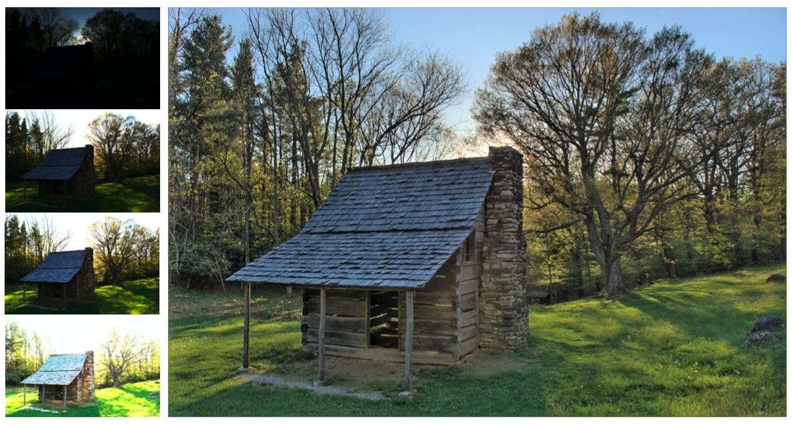

# Unpaired Learning for High Dynamic Range Image Tone Mapping

Pytorch implementation of our method for HDR image tome mapping using GAN.
### [Project]() | [Paper]()
<br>
<br>


<!-- <p align='center'>  
  
</p> -->
## Installation
#### Installation via Docker [Recommended]
We provide a docker that contains the code and all the necessary libraries. It's simple to install and run.
```bash
docker build -t unpaired_tmo .
docker run --name unpaired_tmo -it -p 8888:8888 unpaired_tmo /bin/bash
```

#### Installation via Pip/Conda/Virtualenv
1.  Clone the repo:
```bash
git clone https://github.com/yael-vinker/unpaired_hdr_tmo.git
cd unpaired_hdr_tmo
```
2. Create a new environment and install the libraries:
```bash
python3.6 -m venv hdr_venv
source hdr_venv/bin/activate
pip install -r requirements.txt
```

<br>
<br>

## Quickstart (Run Demo Locally)

#### Run a model on your own image

To run the trained model of a task on a specific image:

```bash
cd activate_trained_model
python run_trained_model.py
```
Specify the path to a folder containing the input images using `--input_images_path`, the tone mapped images will be saved to the folder under `--output_path`.
